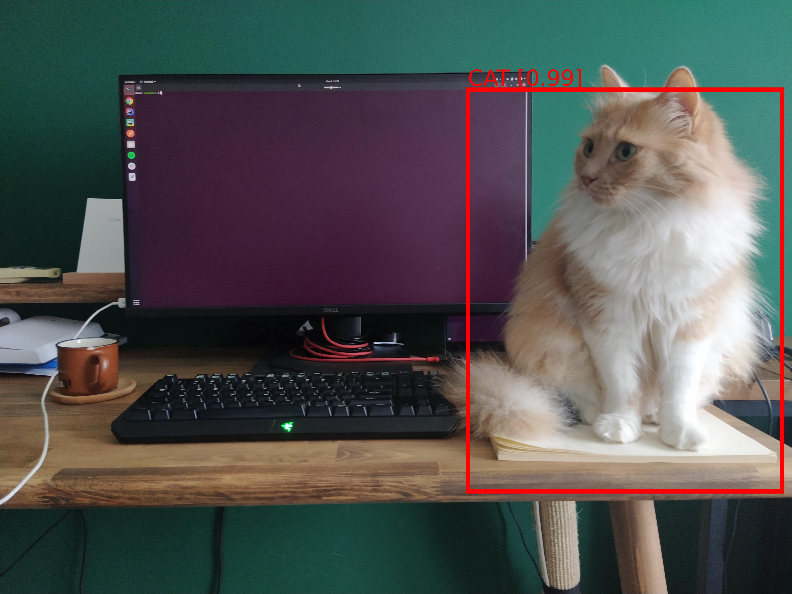
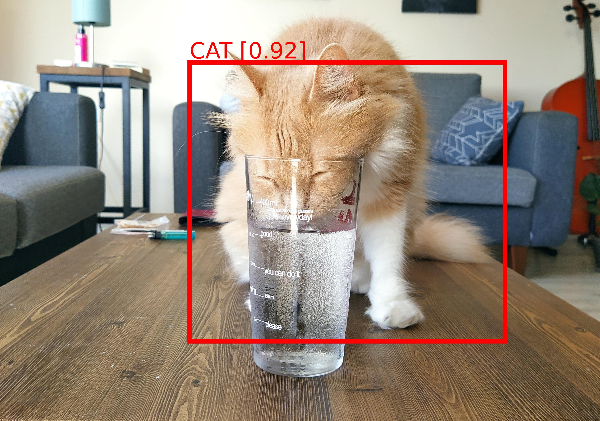
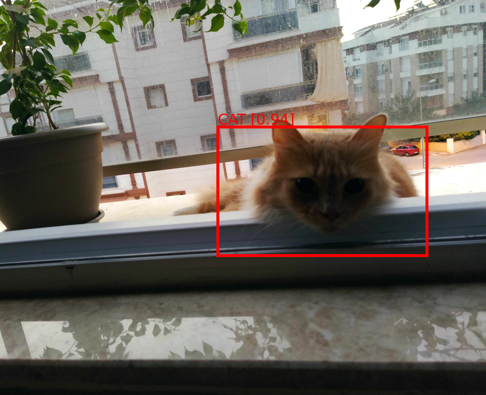
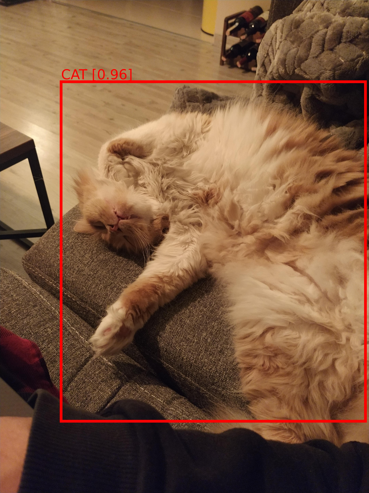

YOLO based cat detector runs in Apple M1 chipset (not tested in any other processor architectures)

#### Requirements
- ```anaconda```/```miniconda```
#### Create environment
- ```conda env create -f m1.yaml```
#### Use environment
- ```conda activate cat-detector```
#### Update environment
- ```conda env update -f m1.yaml --prune```
#### Exit environment
- ```conda deactivate```
#### Remove environment
- ```conda env remove -n cat-detector```
#### Run
- Test file: ```python test.py```
- Application: ```uvicorn app:app --reload```
#### Example
- Request
```
curl --request POST 'http://127.0.0.1:8000/detect' \
--header 'Content-Type: application/json' \
--data-raw '{"image":"{{BASE64_ENCODED_IMAGE}}"}'
```
- Response
```
[
    {
        "label": "cat",
        "score": 0.72,
        "x_min": 66,
        "y_min": 544,
        "x_max": 946,
        "y_max": 858
    }
]
```
#### Results




